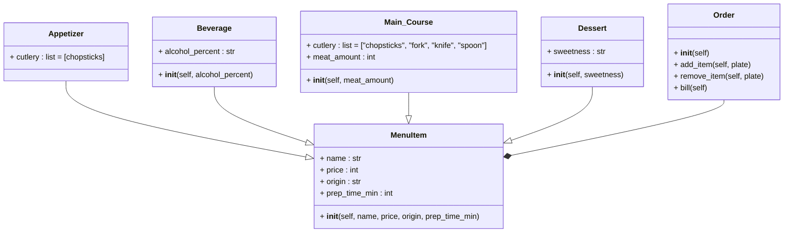

# poo_reto_3
### Soy Rafael Santiago Chirivi Peña y pertenezco al grupo de "Fenomenoides", adelante se muestra nuestro logo 

<details><summary>Preparense para ver el grandioso logo: </summary><p>
<div align='center'>
<figure> </br>
<figcaption><b> "somos programadores, no diseñadores" </b></figcaption></figure>
</div>
</p></details><br>

### A continuacion, se muestran las soluciones propuestas a los distintos puntos de este reto
## 1. Create a repo with the class exercise
El ejercicio era un buen punto de inicio para el tema de composicion, puesto que en clases anteriores ya habiamos definido la clase Point, y aunque al principio me costo entender la definicion de las clases partiendo de que sus instancias serian objetos de otras clases, una vez que lo entendi resulto facil simplemente operar los componentes de los puntos de inicio y final para determinar la longitud y la pendiente de la linea. para el corte con los ejes, afortunadamente recorde el teorema de bolzano del curso de calculo diferencial, haciendo mas facil el entendimiento del punto.
Por ultimo para discretizar la linea, me costo algunos intentos lograr correctamente la generacion de los puntos, pero luego de entender como obtener el incremento de las coordenadas, resulto facil.
```python
from math import atan2
from math import degrees

class Point:
    """Se define un punto del espacio"""

    def __init__(self,x,y):
        # se establecen coordenadas x,y para el punto
        self.x = x
        self.y = y
class Line:
    """Linea con un punto de inicio y uno de final"""

    def __init__(self,start: Point,end: Point):
        # se inicializa un inicio y un final aclarando que estos pertenecen a la clase Point
        self.start = start
        self.end = end

    def compute_lenght(self):
        # hace una diferencia en el eje x y el eje y para asi calcular la longitud mediante pitagoras (a^2 + b^2 = h^2)
        horizontal_lenght = self.end.x-self.start.x
        vertical_lenght = self.end.y - self.start.y
        lenght = (vertical_lenght**2 + horizontal_lenght**2)**(1/2)
        return lenght
    
    def compute_slope(self):
        # usando atan2 calcula en radianes el angulo formado por los componentes x y y del triangulo que forma la recta, para luego transformarlo a grados
        return degrees(atan2(abs(self.end.y - self.start.y), abs(self.end.x-self.start.x)))
    
    def compute_horizontal_cross(self):
        # verifica que la linea corte el eje x multiplicando su inicio y fin en y, si es negativo, pasa por el eje (Teorema de bolzano)
        if self.start.y * self.end.y <= 0:
            print("La recta corta al eje x")

    def compute_vertical_cross(self):
        # verifica que la linea corte el eje y multiplicando su inicio x fin en x, si es negativo, pasa por el eje (Teorema de bolzano)
        if self.start.x * self.end.x <= 0:
            print("La recta corta al eje y")

    def discretize_line(self, n):
        # toma un numero de puntos para discretizar la linea, y define el avance que se hara en cada eje segun la diferencia en los ejes, para luego crear una lista con cada uno de los puntos, iterando hasta que una variable i llegue al valor del n ingresado para la cantidad de puntos
        array_points = []
        x_advance = (self.end.x - self.start.x)/n
        y_advance = (self.end.y - self.start.y)/n
        i = 0
        while i <= n:
            array_points.append((self.start.x, self.start.y))
            self.start.x = self.start.x + x_advance
            self.start.y = self.start.y + y_advance     
            i += 1
        return array_points

class Rectangle:
    """Reinvencion de la clase Rectangle, haciendo uso de composicion de lineas"""
    def __init__(self, height1: Line, height2: Line, width1: Line, width2: Line):
            # se define cada una de las lineas como objetos de la clase Line
            self.height1 = height1
            self.height2 = height2
            self.width1 = width1
            self.width2 = width2

    def compute_area(self):
        # toma coordenadas de los puntos de las lineas para determinar altura y anchura del rectangulo para asi calcular el area
        return ((self.height1.end.y-self.height1.start.y) * (self.width1.end.x - self.width1.start.x))
    
    def compute_perimeter(self):
        # toma coordenadas de los puntos de las lineas para determinar altura y anchura del rectangulo para asi calcular el perimetro
        return 2 * ((self.height1.end.y-self.height1.start.y) + (self.width1.end.x - self.width1.start.x))

if __name__ == "__main__":
    # definicion de una linea ejemplo
    linea_ejemplo = Line(
        start = Point(0,3),
        end = Point(5,2)
    )

    # definicion de un rectangulo ejemplo
    rectangulo_ejemplo = Rectangle(
        height1= Line(
            start = Point(0,0),
            end = Point(0,3)
        ),
        height2= Line(
            start = Point(5,0),
            end = Point(5,3)
        ),
        width1 = Line(
            start = Point(0,0),
            end = Point(5,0)
        ),
        width2= Line(
            start = Point(0,3),
            end = Point(5,3)
        )
    )
    
    # impresion de los calculos del rectangulo (area y perimetro)
    print(f"El area del rectangulo es: {rectangulo_ejemplo.compute_area()}")
    print(f"EL perimetro del rectangulo es: {rectangulo_ejemplo.compute_perimeter()}")
    print("\n")

    # impresion de los calculos de la linea (longitud, grados de inclinacion, corte con los ejes y discretizacion)
    print(f"La longitud de la recta es: {linea_ejemplo.compute_lenght()}")
    print(f"La pendiente de la recta calculada en grados es: {linea_ejemplo.compute_slope()}°")
    linea_ejemplo.compute_horizontal_cross()
    linea_ejemplo.compute_vertical_cross()
    print("\n")
    arreglo = linea_ejemplo.discretize_line(5)
    for i in range(0,len(arreglo)):
        print(f"p{i}= {arreglo[i]}")
```

## 2. Restaurant scenario: You want to design a program to calculate the bill for a customer's order in a restaurant.
- Define a base class MenuItem: This class should have attributes like name, price, and a method to calculate the total price.
- Create subclasses for different types of menu items: Inherit from MenuItem and define properties specific to each type (e.g., Beverage, Appetizer, MainCourse).
- Define an Order class: This class should have a list of MenuItem objects and methods to add items, calculate the total bill amount, and potentially apply specific discounts based on the order composition.

Para este punto, lo mas complejo fue pensar en la tematica y los platos del restaurante, sin embargo, con la recomendacion y creatividad de mi mejor amiga surgio la idea de hacer un restaurante de tematica asiatica. Una vez definida la tematica y los platos, me costo definir que diferenciaria a los tipos de platos entre si, siendo que la primera caracteristica que surgio fueron los cubiertos con que se comen los platos, partiendo de esta idea, fue mas facil darle algo unico que distinguiera cada subclase de los tipos de plato.
Al final, la orden fue algo facil de definir, y aunque tuve algunos problemas para definir el agregado de platos, costo una busqueda para facilitar el metodo, para al final definir algunos ejemplos y poner a prueba los descuentos establecidos
El menu desarrollado fue el siguiente

<strong> Entradas: </strong>
1. Takoyaki (buñuelos japoneses)
2. Tteokbokki (pastel de arroz)
3. Mandu (empanadilla coreana)

<strong> Platos fuertes: </strong>
1. Corte se wagyu (vaca japonesa)
2. Curry tradicional 
3. Ramen (fideos japoneses)

<strong> Bebidas: </strong>
1. sake (alcohol)
2. Jiuniang (vino de arroz fermentado)
3. te con leche y tapioca (te de burbujas)

<strong> Postre: </strong>
1. Wagashi (dulce japones parecido al mochi)
2. Yuèbǐng (pastel de Luna chino)
3. Tanghulu (frutas frescas cubiertas de caramelo).
```python
class MenuItem:
    """Definicion estandar para un item del menu"""

    def __init__(self, name: str, price : float, origin: str, prep_time_min : int):
        # se establecen variables sencillas y generales para cada plato: nombre, precio, origen y tiempo de preparacion
        self.name = name
        self.price = price
        self.origin = origin
        self.prep_time_min = prep_time_min

class Appetizer(MenuItem):
    """Tipo 1 de item del menu: Aperitivo"""

    cutlery = ["chopsticks"]    # cubierto con el cual se comen las entradas
    def __init__(self, name, price, origin, prep_time_min):
        # toma todas las variables de inicio de MenuItem
        super().__init__(name,price, origin, prep_time_min)

class Beverage(MenuItem):
    """Tipo 2 de item del menu: Bebida"""

    def __init__(self, name, price, origin, prep_time_min, alcohol_percent : int):
        # toma todas las variables de inicio de MenuItem, añadiendo la de porcentaje de alcohol
        super().__init__(name,price, origin, prep_time_min)
        self.alcohol_percent = alcohol_percent

class Main_Course(MenuItem):
    """Tipo 3 de item del menu: Plato principal"""

    cutlery = ["chopsticks", "fork", "knife", "spoon"]  # cubierto con el cual se comen los platos principales
    def __init__(self, name, price, origin, prep_time_min, meat_amount : int):
        # toma todas las variables de inicio de MenuItem, añadiendo la de cantidad de carne
        super().__init__(name,price, origin, prep_time_min)
        self.meat_amount = meat_amount

class Dessert(MenuItem):
    """Tipo 4 de item del menu: Postre"""

    def __init__(self, name, price, origin, prep_time_min, sweetness : str):
        # toma todas las variables de inicio del MenuItem, añadiendo la de dulzura del postre
        super().__init__(name,price, origin, prep_time_min)
        self.sweetness = sweetness

class Order:
    """orden que hara el cliente"""

    def __init__(self):
        # crea una lista vacia para registrar los platos a ordenar
        self.order_list = []

    def add_item(self, plate):
        # verifica que el objeto a ingresar pertenece a la clase MenuItem, para despues agregarlo a la lista order_list
        if isinstance(plate, MenuItem):
            self.order_list.append(plate)

    def remove_item(self, plate: MenuItem):
        # verifica que el objeto a ingresar pertenece a la clase MenuItem, para despues retirarlo de la lista order_list
        if isinstance(plate, MenuItem):
            self.order_list.remove(plate)

    def bill(self):
        # establece un valor de la cuenta en 0, y una lista que registre el tipo de cada plato, recorriendo la lista de la orden y sumando a la cuenta el valor del precio de cada plato, mientras registra el tipo de comida de cada plato, para al final hacer una verificacion de los tipos de platos en la orden para asi realizar un descuento de 10% (plato principal y bebida), o bien del 20% (un plato de cada tipo)
        bill = 0
        plate_type = []
        for i in range(0, len(self.order_list)):
            bill += self.order_list[i].price
            plate_type.append(type(self.order_list[i]))
        if Appetizer in plate_type and Main_Course in plate_type and Beverage in plate_type and Dessert in plate_type:
            bill = bill * 0.80
        elif Beverage in plate_type and Main_Course in plate_type:
            bill = bill * 0.90
        return bill
    
if __name__ == "__main__":
    # Definicion de 3 objetos por cada tipo de comida
    # precios establecidos en USD
    # cantidad de carne en gramos
    appet1 = Appetizer(
        name = "Takoyaki",
        price = 8.5, #USD
        origin = "japan",
        prep_time_min = 15
    )
    appet2 = Appetizer(
        name = "Tteokbokki",
        price = 7,   #USD
        origin = "Korea",
        prep_time_min = 40
    )
    appet3 = Appetizer(
        name = "Mandu",
        price = 8.5, #USD
        origin = "Korea",
        prep_time_min = 50
    )
    bev1 = Beverage(
        name = "Sake bottle",
        price = 15,  #USD
        origin = "Japan",
        prep_time_min = 0,
        alcohol_percent = 15 
    )
    bev2 = Beverage(
        name = "jiuniang",
        price = 12,  #USD
        origin = "China",
        prep_time_min = 30,
        alcohol_percent = 2
    )
    bev3 = Beverage(
        name = "bubble tea",
        price = 15,  #USD
        origin = "Taiwan",
        prep_time_min = 130,
        alcohol_percent = 0
    )
    main1 = Main_Course(
        name = "wagyu",
        price = 25,  #USD
        origin = "Japan",
        prep_time_min = 10,
        meat_amount = 300   #grams
    )
    main2 = Main_Course(
        name = "Curry",
        price = 20,  #USD
        origin = "India",
        prep_time_min = 20,
        meat_amount = 150   #grams
    )
    main3 = Main_Course(
        name = "Ramen",
        price = 20,  #USD
        origin = "Japan",
        prep_time_min = 120,
        meat_amount = 50    #grams
    )
    des1 = Dessert(
        name = "wagashi",
        price = 5,  #USD
        origin = "Japan",
        prep_time_min = 300,
        sweetness = "Moderate"
    )
    des2 = Dessert(
        name = "Yuèbǐng",
        price = 8,  #USD
        origin = "China",
        prep_time_min = 60,
        sweetness = "Low"
    )
    des3 = Dessert(
        name = "Tanghulu",
        price = 6,  #USD
        origin = "China",
        prep_time_min = 30,
        sweetness = "High"
    )

    # definicion de orden 1
    Client1 = Order()
    Client1.add_item(appet2)    # agregado de tteokbokki
    Client1.add_item(main2)     # agregado de curry
    Client1.add_item(bev1)      # agregado de sake
    Client1.add_item(des1)      # agregado de wagashi
    order_Client1 = []  #se establece una lista vacia
    for i in range(0, len(Client1.order_list)): # se añade a la lista los nombres de cada uno de los platos pedidos
        order_Client1.append(Client1.order_list[i].name)
    print(f"La orden de {order_Client1} tiene un valor de ${Client1.bill()} USD")   # se imprime los platos pedidos y el precio de estos

    # definicion de orden 2
    Client2 = Order()
    Client2.add_item(appet3)    # agregado de mandu
    Client2.add_item(main3)     # agregado de ramen
    Client2.add_item(bev3)      # agregado de te
    Client2.add_item(des3)      # agregado de tanghulu
    order_Client2 = []  #se establece una lista vacia
    for i in range(0, len(Client2.order_list)): # se añade a la lista los nombres de cada uno de los platos pedidos
        order_Client2.append(Client2.order_list[i].name)
    print(f"La orden de {order_Client2} tiene un valor de ${Client2.bill()} USD")   # se imprime los platos pedidos y el precio de estos

    # definicion de orden 3
    Client3 = Order()
    Client3.add_item(main1)     # agregado de wagyu
    Client3.add_item(bev1)      # agregado de sake
    order_Client3 = []  #se establece una lista vacia
    for i in range(0, len(Client3.order_list)): # se añade a la lista los nombres de cada uno de los platos pedidos
        order_Client3.append(Client3.order_list[i].name)
    print(f"La orden de {order_Client3} tiene un valor de ${Client3.bill()} USD")   # se imprime los platos pedidos y el precio de estos
```

A continuacion se presenta el diagrama de clases relacionado a este punto:


